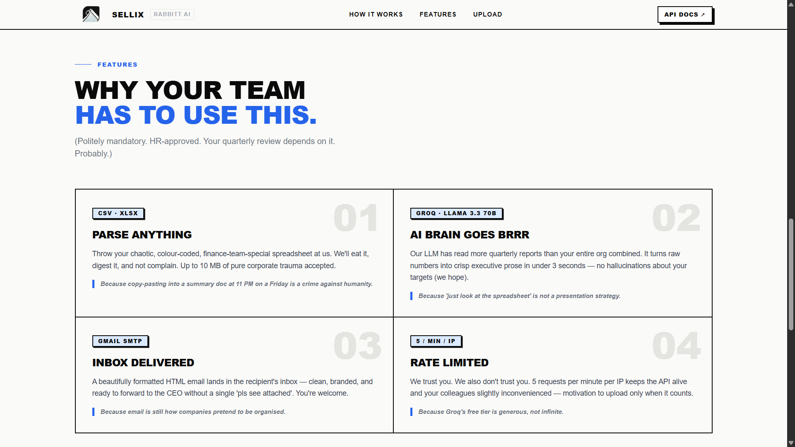
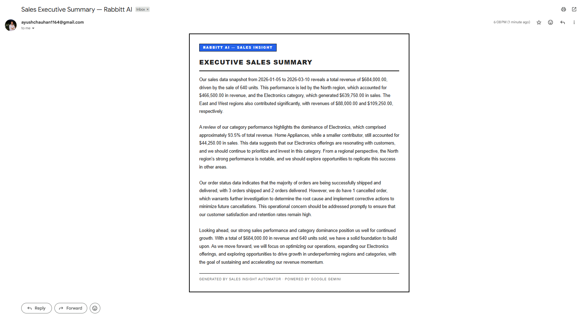

# Sales Insight Automator

> Upload a `.csv` or `.xlsx` sales file, get an AI-generated executive summary delivered straight to your inbox — powered by **Groq LLaMA 3.3** and **Brevo**.
> Built for Rabbitt AI's Cloud DevOps Engineering sprint.

**Live:** [Frontend](https://sellix-sales-insight-generator.vercel.app) · [Swagger UI](https://sellix-sales-insight-generator.onrender.com/docs) · [ReDoc](https://sellix-sales-insight-generator.onrender.com/redoc) · [Health](https://sellix-sales-insight-generator.onrender.com/health)

---

## Screenshots

### Hero


### Features



### Live result — email delivered



_Drop a file, enter an email, hit Analyse — the formatted HTML summary lands in your inbox within seconds._

---

## How it works

```
Browser (Next.js)
    │  multipart/form-data  (file + email)
    ▼
FastAPI  ──► pandas parses CSV/XLSX → computes aggregates
    │
    ▼
Groq Cloud  (llama-3.3-70b-versatile)
    │  returns executive narrative summary
    ▼
Brevo  (transactional email HTTP API)
    │  sends branded HTML email
    ▼
Recipient's inbox ✓
```

---

## Stack

| Layer      | Tech                                                                                                 |
| ---------- | ---------------------------------------------------------------------------------------------------- |
| Frontend   | Next.js 14 (App Router) · TypeScript · Tailwind CSS · react-dropzone                                 |
| Backend    | FastAPI 0.115 · Python 3.11 · uvicorn · pandas · slowapi                                             |
| LLM        | **Groq Cloud** — `llama-3.3-70b-versatile` (14 400 RPD free tier)                                    |
| Email      | **Brevo** (formerly Sendinblue) transactional email HTTP API — 300 emails/day free, no domain needed |
| Containers | Docker · docker-compose (no `version:` key — Docker 26+)                                             |
| CI/CD      | GitHub Actions — flake8 · ESLint/tsc · docker-compose build                                          |

---

## API endpoints

**Production base URL:** `https://sellix-sales-insight-generator.onrender.com`

**Local base URL:** `http://localhost:8000`

| Method | Path             | Description                                        |
| ------ | ---------------- | -------------------------------------------------- |
| `POST` | `/api/v1/upload` | Upload `.csv`/`.xlsx` + email → AI summary → inbox |
| `GET`  | `/health`        | Health check — returns `{"status": "ok"}`          |
| `GET`  | `/docs`          | Swagger UI (interactive)                           |
| `GET`  | `/redoc`         | ReDoc reference docs                               |

### POST `/api/v1/upload`

| Field   | Type                  | Notes                              |
| ------- | --------------------- | ---------------------------------- |
| `file`  | `multipart/form-data` | `.csv` or `.xlsx`, max 10 MB       |
| `email` | `form field`          | Valid email — summary is sent here |

**Rate limit:** 5 requests / minute / IP

**Response 200:**

```json
{
  "message": "Summary generated and sent to your inbox.",
  "recipient": "you@example.com"
}
```

---

## Running locally

### Prerequisites

| Requirement    | Version | Notes                                             |
| -------------- | ------- | ------------------------------------------------- |
| Docker Desktop | 26+     | Compose V2 built-in (`docker compose`, no hyphen) |
| Node.js        | 20+     | Only needed for local (non-Docker) dev            |
| Python         | 3.11+   | Only needed for local (non-Docker) dev            |

---

### Step 1 — Clone & configure env

```bash
git clone <your-repo-url>
cd sellix
cp backend/.env.example backend/.env
```

Edit `backend/.env` and fill in every value:

```env
GROQ_API_KEY=gsk_...                  # console.groq.com/keys — free account, no card needed
BREVO_API_KEY=xkeysib-...             # app.brevo.com/settings/keys/api — free: 300 emails/day
BREVO_SENDER_EMAIL=you@gmail.com      # must be verified in Brevo dashboard
BREVO_SENDER_NAME=Sales Insight Automator
FRONTEND_URL=http://localhost:3000   # CORS allowlist — change to your Vercel URL in prod
```

> **`NEXT_PUBLIC_API_URL`** is a **frontend** env var. Set it in the Vercel dashboard (Project Settings → Environment Variables) — it is **not** read by the backend and should not be in `backend/.env`.

> **Brevo API key:** Sign up at [brevo.com](https://www.brevo.com) (free, no credit card). Go to Settings → SMTP & API → API Keys → Generate. The free tier gives you **300 emails/day**. You only need to verify your sender email (any Gmail works) — **no custom domain required**. Anyone can receive the emails.

---

### Option A — Full stack via Docker Compose (recommended)

**First run (builds both images from scratch):**

```bash
docker compose up --build
```

**Subsequent runs (uses cached layers — much faster):**

```bash
docker compose up
```

**Run in background (detached):**

```bash
docker compose up -d --build
```

**Stop and remove containers:**

```bash
docker compose down
```

**Stop and also remove volumes/images:**

```bash
docker compose down --volumes --rmi all
```

Once running:

| Service      | Local                        | Production                                                 |
| ------------ | ---------------------------- | ---------------------------------------------------------- |
| Frontend     | http://localhost:3000        | https://sellix-sales-insight-generator.vercel.app          |
| Backend API  | http://localhost:8000        | https://sellix-sales-insight-generator.onrender.com        |
| Swagger UI   | http://localhost:8000/docs   | https://sellix-sales-insight-generator.onrender.com/docs   |
| ReDoc        | http://localhost:8000/redoc  | https://sellix-sales-insight-generator.onrender.com/redoc  |
| Health check | http://localhost:8000/health | https://sellix-sales-insight-generator.onrender.com/health |

---

### Option B — Build & run each image individually

Useful when you want to iterate on one service without touching the other.

#### Backend

```bash
# Build
docker build -t sellix-backend ./backend

# Run (pass the .env file directly)
docker run --rm \
  --env-file ./backend/.env \
  -p 8000:8000 \
  --name sellix-backend \
  sellix-backend
```

#### Frontend

The Next.js image bakes `NEXT_PUBLIC_API_URL` at **build time** (it gets embedded into the JS bundle), so pass it as a build arg:

```bash
# Build — point at your running backend
docker build \
  --build-arg NEXT_PUBLIC_API_URL=http://localhost:8000 \
  -t sellix-frontend \
  ./frontend

# Run
docker run --rm \
  -p 3000:3000 \
  --name sellix-frontend \
  sellix-frontend
```

> If you're deploying the frontend against a remote backend (e.g. Render), replace `http://localhost:8000` with the Render service URL at build time.

---

### Viewing logs

```bash
# Tail both services at once
docker compose logs -f

# Tail backend only
docker compose logs -f backend

# Tail frontend only
docker compose logs -f frontend

# Individual container (Option B)
docker logs -f sellix-backend
```

---

### Useful Docker commands

```bash
# See running containers and their ports
docker ps

# Restart a single service without rebuilding
docker compose restart backend

# Rebuild a single service after code changes
docker compose up -d --build backend

# Open a shell inside the backend container
docker exec -it sellix-backend-1 sh

# Check image sizes
docker images | grep sellix
```

---

### Option C — Local dev (no Docker)

**Backend:**

```bash
cd backend
python -m venv venv
source venv/bin/activate        # Windows: venv\Scripts\activate
pip install -r requirements.txt
uvicorn app.main:app --reload --host 0.0.0.0 --port 8000
```

**Frontend (separate terminal):**

```bash
cd frontend
npm install
npm run dev    # → http://localhost:3000
```

---

## Project structure

```
sellix/
├── backend/
│   ├── app/
│   │   ├── main.py          # FastAPI app, CORS, rate limiter, ReDoc
│   │   ├── ai_service.py    # Groq LLaMA call — builds prompt, returns summary
│   │   ├── email_service.py # Brevo transactional email sender
│   │   ├── file_parser.py   # pandas CSV/XLSX parser → aggregates dict
│   │   └── limiter.py       # shared slowapi Limiter instance
│   ├── routers/
│   │   └── upload.py        # POST /api/v1/upload — validate → parse → AI → email
│   ├── schemas.py           # Pydantic response models
│   ├── requirements.txt
│   ├── Dockerfile
│   └── .env.example
├── frontend/
│   ├── app/
│   │   ├── layout.tsx
│   │   └── page.tsx
│   ├── UploadForm.tsx        # Drag-drop UI, 4 states (idle/loading/success/error)
│   ├── lib/api.ts            # uploadFile() → POST multipart FormData
│   ├── next.config.mjs
│   ├── tailwind.config.ts
│   └── Dockerfile
├── ss/
│   └── image.png            # working screenshot
├── sales_q1_2026.csv        # sample test file
├── docker-compose.yml
└── .github/workflows/ci.yml
```

---

## CI/CD

GitHub Actions runs on every PR → `main`:

| Job             | What it checks                                          |
| --------------- | ------------------------------------------------------- |
| `lint-backend`  | `flake8` on `backend/`                                  |
| `lint-frontend` | `eslint` + `tsc --noEmit` on `frontend/`                |
| `build-docker`  | `docker compose build` — both images must build cleanly |

---

## Security implementation

Below is every security control in this project, what it guards against, and exactly where it lives in the code.

---

### 1. CORS — strict origin whitelist

**What it prevents:** Cross-origin requests from arbitrary domains (e.g. a malicious site calling your API and impersonating your frontend).

**How it's implemented** (`backend/app/main.py`):

```python
app.add_middleware(
    CORSMiddleware,
    allow_origins=[os.getenv("FRONTEND_URL", "http://localhost:3000")],
    allow_methods=["GET", "POST"],
    allow_headers=["*"],
)
```

`allow_origins` is **never** `"*"`. It is read from the `FRONTEND_URL` env var — only one domain is permitted. In production, set `FRONTEND_URL` to your exact Vercel/deployment URL.

---

### 2. Rate limiting — 5 requests / minute / IP

**What it prevents:** Abuse, API quota exhaustion, and denial-of-service via the upload endpoint.

**How it's implemented** (`backend/app/limiter.py` + `backend/routers/upload.py`):

```python
# limiter.py
from slowapi import Limiter
from slowapi.util import get_remote_address
limiter = Limiter(key_func=get_remote_address)

# upload.py
@limiter.limit("5/minute")
async def upload_sales_file(request: Request, ...):
```

`slowapi` wraps the route with an IP-keyed token bucket. Exceeding the limit returns **HTTP 429** automatically.

---

### 3. File validation — extension AND MIME type

**What it prevents:** Uploading arbitrary files (executables, scripts, HTML) disguised as spreadsheets; path traversal; processing unexpected binary formats.

**How it's implemented** (`backend/routers/upload.py`):

```python
ALLOWED_EXTENSIONS = {".csv", ".xlsx"}
ALLOWED_MIME_TYPES = {
    "text/csv",
    "application/vnd.openxmlformats-officedocument.spreadsheetml.sheet",
    "application/vnd.ms-excel",
    "application/octet-stream",   # some browsers send this for .csv
}
MAX_SIZE_BYTES = 10 * 1024 * 1024   # 10 MB

ext = os.path.splitext(file.filename or "")[1].lower()
if ext not in ALLOWED_EXTENSIONS:      # HTTP 422 if wrong ext
    raise HTTPException(status_code=422, ...)
if file.content_type not in ALLOWED_MIME_TYPES:  # HTTP 422 if wrong MIME
    raise HTTPException(status_code=422, ...)
if len(content) > MAX_SIZE_BYTES:      # HTTP 413 if too large
    raise HTTPException(status_code=413, ...)
```

Both the filename extension **and** the browser-reported MIME type must match an allowlist. File size is hard-capped after reading the raw bytes (not trusting the `Content-Length` header).

---

### 4. Email validation — Pydantic `EmailStr`

**What it prevents:** Garbage strings, injection attempts, or typos being passed to the SMTP sender.

**How it's implemented** (`backend/routers/upload.py`):

```python
from pydantic import EmailStr

async def upload_sales_file(
    ...,
    email: EmailStr = Form(...),
):
```

FastAPI/Pydantic validates the email field against RFC 5322 before the handler even runs. Invalid addresses return **HTTP 422** automatically.

---

### 5. Non-root Docker user

**What it prevents:** Container breakout privilege escalation — if the app process is compromised, it cannot write to the host filesystem or execute privileged syscalls.

**How it's implemented** (`backend/Dockerfile`):

```dockerfile
RUN adduser --disabled-password --gecos "" appuser
USER appuser
```

The backend runs as `appuser` (UID > 1000), not `root`.

---

### 6. Secrets never committed — `.gitignore`

**What it prevents:** API keys and SMTP credentials leaking into the git history / GitHub.

**How it's implemented** (`.gitignore`):

```
backend/.env
```

`backend/.env` (which contains `GROQ_API_KEY`, `BREVO_API_KEY`, etc.) is excluded from git. Only `backend/.env.example` (with placeholder values) is committed.

> **Lesson learned the hard way:** An earlier iteration accidentally committed the `.env` file. Recovery required `git rm --cached backend/.env` + `git commit --amend` + `git push --force`. Google auto-revoked the leaked Gemini key within minutes. Don't commit secrets.

---

### 7. Brevo API key — scoped transactional email

**What it prevents:** Exposing full email account credentials. Brevo API keys are scoped to sending only, easily rotatable, and don't grant access to any mailbox.

**How it's implemented** (`backend/app/email_service.py`):

```python
import sib_api_v3_sdk

configuration = sib_api_v3_sdk.Configuration()
configuration.api_key["api-key"] = os.environ["BREVO_API_KEY"]
api_instance = sib_api_v3_sdk.TransactionalEmailsApi(
    sib_api_v3_sdk.ApiClient(configuration)
)
```

`BREVO_API_KEY` is a scoped API token from [brevo.com](https://www.brevo.com). All communication uses HTTPS — no SMTP ports needed, which avoids port-blocking issues on platforms like Render's free tier. **No custom domain required** — just verify your sender email and send to any recipient.

---

### 8. Brevo HTTPS transport — encrypted by default

**What it prevents:** Email content being transmitted in plaintext. Unlike SMTP which requires explicit STARTTLS negotiation, Brevo's HTTP API uses TLS by default.

**How it's implemented:** The `sib-api-v3-sdk` Python SDK sends all requests over `https://api.brevo.com` — encrypted end-to-end with no configuration needed.

---

### Security summary

| Control                | Protects against                  | HTTP response if violated |
| ---------------------- | --------------------------------- | ------------------------- |
| CORS whitelist         | Cross-origin API abuse            | 403                       |
| Rate limit 5/min/IP    | DoS / quota exhaustion            | 429                       |
| Extension + MIME check | Malicious file uploads            | 422                       |
| File size cap 10 MB    | Memory exhaustion                 | 413                       |
| Pydantic `EmailStr`    | Bad/injected email input          | 422                       |
| Non-root Docker user   | Container privilege escalation    | —                         |
| `.env` in `.gitignore` | Secret leakage to git             | —                         |
| Brevo API key          | Full account credential exposure  | —                         |
| Brevo HTTPS transport  | Plaintext credential transmission | —                         |

---

## Sidenote — Render free tier & UptimeRobot

Render's free tier spins a service **down after 15 minutes of inactivity**. The next request then triggers a cold start that takes **30–60 seconds** before the app responds. To prevent this:

### UptimeRobot keep-alive (recommended — free)

1. Sign up at [uptimerobot.com](https://uptimerobot.com) (free plan supports up to 50 monitors).
2. Create a new **HTTP(s)** monitor:
   - **Friendly name:** `sellix-backend`
   - **URL:** `https://sellix-sales-insight-generator.onrender.com/health`
   - **Monitoring interval:** `5 minutes`
3. Save. UptimeRobot pings `/health` every 5 minutes, keeping the service warm 24/7.

> **Note on the first-deploy "down" alert:** When you add a freshly deployed Render service to UptimeRobot, the very first ping often fires while the service is still in its initial cold-start boot (30–60 s). UptimeRobot's timeout fires before the service finishes starting, and it sends a **"service down — Connection Timeout"** alert. This is a **false positive** — not a real outage. Within a minute or two the service is up and UptimeRobot sends a recovery email. All subsequent pings (every 5 min) keep the service warm, so you won't see cold-start timeouts again.
